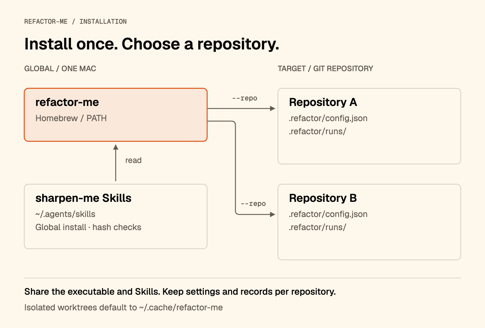

# refactor-me

Automate behavior-preserving refactoring with Codex or Claude Code. The CLI works in an isolated Git worktree, validates each candidate, and saves accepted commits on a local branch for your review.

[한국어](docs/README.ko.md) · [Usage guide](tool/TUTORIAL.md) · [Reference](tool/README.md) · [Workflow](tool/WORKFLOW.md)

## Install

Public Beta **0.10.0-beta.1** supports **macOS Apple Silicon**. You need Homebrew, Git, an authenticated Codex or Claude Code CLI, and your target project's build and test tools.

<a id="quick-start"></a>

```sh
brew install soom-kang/refactor-me/refactor-me
refactor-me version --json
```

Install sharpen-me Skills globally. This separate installer requires Node.js; running refactor-me does not.

```sh
npx skills add soom-kang/sharpen-me \
  --global --skill '*' --agent codex claude-code
```

Homebrew manages the executable. Required Skills resolve from `~/.agents/skills`. Each target repository keeps its own configuration and run records.



## First run

Replace the path with a clean Git repository that has at least one commit. Prepare its dependencies first. The commands below select Codex only; replace `codex` with `claude` for Claude Code.

```sh
refactor-me init --repo /path/to/target-repo
refactor-me doctor --repo /path/to/target-repo \
  --provider codex --fallback none --no-live-probe
```

`init` preserves existing configuration. Run it before setting first-run limits in the configuration file; otherwise initialization is optional. This doctor check makes no model calls. **Set [first-run limits](tool/TUTORIAL.md#set-limits-and-run) before starting:**

```sh
refactor-me run --repo /path/to/target-repo \
  --provider codex --fallback none
refactor-me report --repo /path/to/target-repo
```

`run` and doctor without `--no-live-probe` consume provider usage. Exit `0` can mean partial completion: inspect the report and diff before merging. The CLI does not merge, push or deploy results.

## Read next

| Task | Document |
| --- | --- |
| Install, choose a target, run and inspect results | [Usage guide](tool/TUTORIAL.md) |
| Look up commands, settings and exit codes | [Reference](tool/README.md) |
| Understand isolation, validation and review | [Workflow](tool/WORKFLOW.md) |
| Build, test or prepare a release | [Development](tool/DEVELOPMENT.md) · [Homebrew release](tool/release/HOMEBREW.md) |
| Check changes between versions | [Changelog](tool/CHANGELOG.md) |

This Beta has no Apple signing or notarization. See [installation details](tool/release/INSTALL.md) for standalone downloads and macOS warnings.

## License

[MIT](LICENSE), copyright 2026 soom-kang. Keep the copyright and license notice when redistributing the CLI or documentation. The software comes without warranty. sharpen-me retains its own license; Codex and Claude Code follow their providers' terms.
