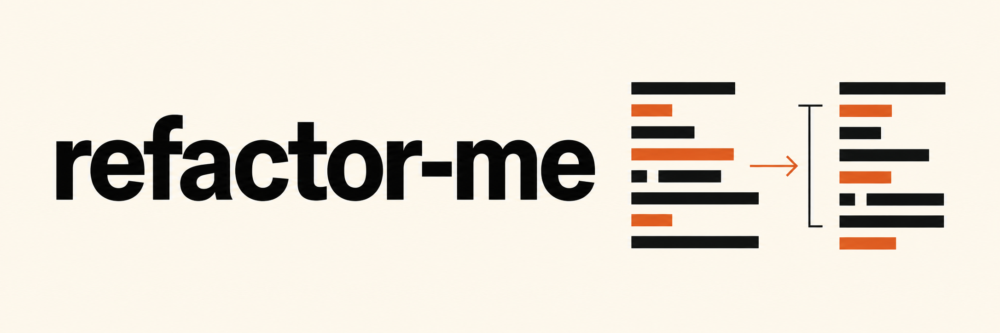

# refactor-me

Codex와 Claude Code로 동작을 유지하는 리팩터링을 실행합니다. 결과로 남긴 로컬 브랜치와 검증 리포트를 확인한 뒤 병합하세요.

[English](../README.md) · [실행 가이드](../tool/TUTORIAL.ko.md) · [상세 문서](../tool/README.ko.md) · [변경 이력](../tool/CHANGELOG.md)

refactor-me는 저장소를 조사해 후보 하나를 고르고, 근거를 확인한 뒤 별도 worktree에서 수정합니다. 검증과 독립 리뷰를 통과한 변경을 `refactor/auto-*` 로컬 브랜치에 커밋하고, 설정한 한도 안에서 반복합니다.

각 단계에서 [sharpen-me](https://github.com/soom-kang/sharpen-me)의 Skill 8개를 사용합니다. 이 저장소에는 실행을 조율하는 CLI가 있습니다. 설치된 Skill 파일과 `skills-lock.json`에서 이 checkout이 사용하는 카탈로그를 확인할 수 있습니다.

## 설치

macOS, Node.js 24 이상, Git과 인증된 `codex` 또는 `claude` CLI가 필요합니다. 실행 전에 대상 프로젝트의 의존성을 설치하고 빌드 도구 캐시를 준비하세요. 프로바이더 호출에는 네트워크가 필요합니다.

이 저장소의 루트에서 리팩터링할 저장소에 도구를 설치합니다.

```bash
node tool/install.mjs /path/to/target-repo
```

Skill은 **대상 저장소**에서 Project 범위로 설치합니다.

```bash
cd /path/to/target-repo
npx skills add soom-kang/sharpen-me --skill '*' --agent codex claude-code
```

설치된 Skill 파일, 에이전트 링크와 lockfile을 검토하고 커밋한 뒤 실행하세요. 각 단계는 기준 커밋의 checkout을 사용하므로 커밋하지 않은 프로젝트 Skill을 읽을 수 없습니다. 이 도구의 격리 설정에서 Claude는 프로젝트 Skill을 읽습니다. Claude의 전역 설치만으로는 이 조건을 충족하지 못합니다.

설치기는 도구를 `.refactor/`에 복사하고 기존 설정과 실행 기록을 보존합니다. 도구 자체는 npm 패키지 설치나 빌드가 필요하지 않습니다.

## 실행

대상 저장소에서 실행합니다.

```bash
./.refactor/bin/refactor-me version
./.refactor/bin/refactor-me doctor
./.refactor/bin/refactor-me --provider codex --fallback none
```

`doctor`는 실행 조건을 확인하고 진단 기록을 남깁니다. 기본 프로바이더 검사는 모델을 호출합니다. `doctor --no-live-probe`를 사용하면 호출을 생략하지만 세션에서 Skill을 읽을 수 있는지는 검증하지 않습니다.

두 프로바이더를 사용하거나 후보 탐색 범위를 지정할 수 있습니다.

```bash
./.refactor/bin/refactor-me --provider codex --fallback claude
./.refactor/bin/refactor-me --target app/web
./.refactor/bin/refactor-me --target app/web --target app/api
```

`--target`은 후보를 찾는 범위를 제한합니다. 후보에 따라 지정한 폴더 밖의 호출부와 테스트도 수정할 수 있습니다. 도달성 검색과 검증은 저장소 전체를 기준으로 수행합니다.

실행 중 로컬 커밋과 결과 브랜치를 만듭니다. merge, push, 배포는 수행하지 않습니다. 실행하는 동안 원본 checkout에 변경을 추가하지 마세요.

## 단계별 Skill

| Skill | 사용 시점 | 결과 |
| --- | --- | --- |
| `sharpen-clarify` | Audit와 characterization의 범위를 정할 때 | 작업 범위와 확인할 계약 |
| `sharpen-review` | Audit 또는 deep check에서 후보를 검토할 때 | 저장소 근거를 갖춘 발견 사항 |
| `sharpen-challenge` | Audit, deep check, characterization, preflight에서 가정을 검토할 때 | 근거가 있는 반론과 확인 방법 |
| `sharpen-assess` | Audit에서 변경 위험도를 판단할 때 | 위험도 분류, 근거가 부족한 후보 제외 |
| `sharpen-refine` | 승인된 작업 명세를 실행할 때 | 범위 안의 변경 또는 변경하지 않은 이유 |
| `sharpen-cold-review` | 별도 세션에서 구현을 검토할 때 | 리뷰 판정과 발견 사항 |
| `sharpen-brief` | 쿼터나 인증 문제로 프로바이더를 전환할 때 | 전환 시점의 상태 요약 |
| `sharpen-dedupe` | 중복 제거 후보를 검증하거나 실행할 때 | 중복 분석과 범위 안의 통합 |

루프가 단계별 Skill 허용 목록, 출력 스키마와 권한을 정합니다. 모델과 추론 수준은 루프 설정을 따르며 Skill의 권고로 바뀌지 않습니다.

## 리포트

기본 언어는 영어입니다. 실행하거나 저장된 리포트를 볼 때 한국어를 선택할 수 있습니다.

```bash
./.refactor/bin/refactor-me --lang ko
./.refactor/bin/refactor-me report
./.refactor/bin/refactor-me report --lang ko
./.refactor/bin/refactor-me report --json
```

실행마다 선택한 언어의 `report.md` 하나와 언어에 영향을 받지 않는 `report.json`을 저장합니다. 다른 언어로 조회할 때는 저장된 JSON을 렌더링하며 파일을 덮어쓰거나 모델을 호출하지 않습니다. 제목, 상태와 알려진 사유를 번역합니다. 커밋 제목, 모델 설명, 명령과 오류 메시지는 원문을 유지합니다.

## 검증

이 저장소 루트에서 실행합니다.

```bash
node --test tool/test/*.test.mjs
node tool/bin/refactor-me.mjs help
node tool/bin/refactor-me.mjs version --json
```

테스트는 로컬 라우팅, 변경 검사, 리포트, 설치와 CLI 동작을 확인합니다. 실제 프로바이더 판단의 품질을 보장하지는 않습니다. 검증 범위는 [상세 문서](../tool/README.ko.md), 결과 확인 절차는 [실행 가이드](../tool/TUTORIAL.ko.md)를 참고하세요.
