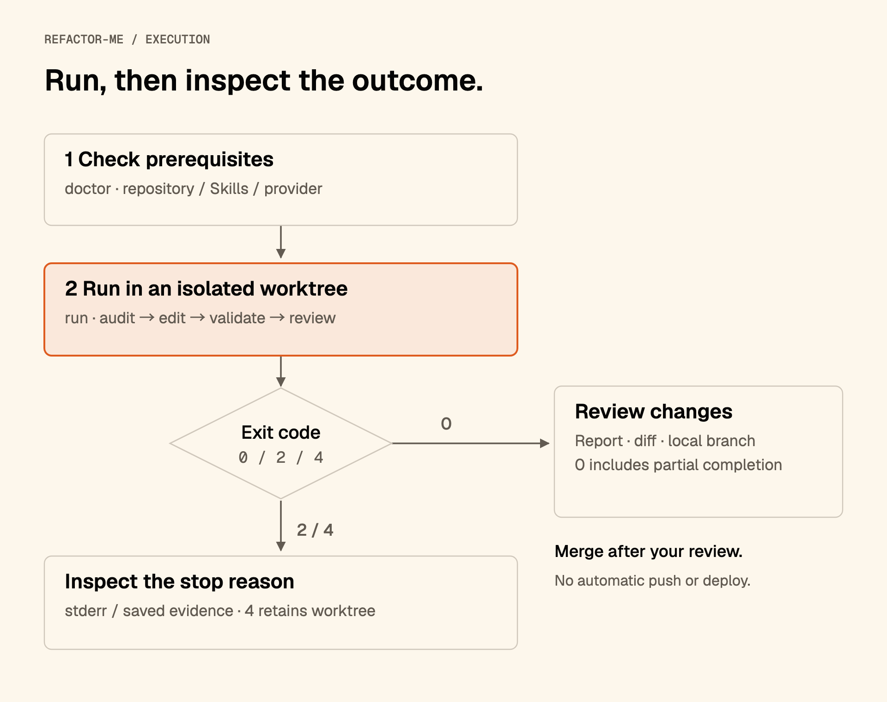

# Run your first refactoring

[Project](../README.md) · [한국어](TUTORIAL.ko.md) · [Reference](README.md)

Follow these five steps on macOS Apple Silicon. Replace `/path/to/target-repo` with your repository path. Quote paths that contain spaces.

This guide covers public Beta `0.10.0-beta.4` for macOS Apple Silicon. Release commit: `0032e594eaab3240d4dee1aa133be5b9d6eb3c42`. The [public installation check](https://github.com/soom-kang/refactor-me/actions/runs/37208178549) verifies the published tag and Homebrew formula.

Sections labeled development builds describe **Unreleased** changes. Use the [development binary](DEVELOPMENT.md) for those commands; they are not included in the published Beta above.

<a id="prepare-the-target"></a>

## 1. Prepare the repository

Use a Git repository with at least one commit. Finish or set aside changes, including untracked files, then prepare the project's dependencies and run its checks once.

```sh
cd /path/to/target-repo
git rev-parse --show-toplevel
git status --short
```

`git status --short` should print nothing. Keep the source checkout unchanged while refactor-me runs.

Install and authenticate one provider CLI using its own instructions. Check the provider you will use:

```sh
codex login status
# For Claude Code instead:
claude auth status
```

<a id="install-the-tool-and-skills"></a>

## 2. Install the CLI and Skills

You need Homebrew and Node.js for the separate Skill installer. Homebrew supplies Go to build the CLI; the installed CLI needs neither Go nor Node at runtime.

```sh
brew tap soom-kang/refactor-me
brew trust --formula soom-kang/refactor-me/refactor-me
brew install refactor-me
refactor-me version --json
npx skills add soom-kang/sharpen-me \
  --global --skill '*' --agent codex claude-code
```

Tap registration and formula-scoped trust are one-time setup on Homebrew 6 or later. Expect CLI version `0.10.0-beta.4`, platform `darwin`, architecture `arm64` and commit `0032e594eaab3240d4dee1aa133be5b9d6eb3c42`. All eight required Skills must resolve from `~/.agents/skills`. Avoid separate copies of the same required Skill in the target project; doctor reports conflicting paths.

Upgrade an older installation before continuing. For a standalone release archive, follow the [installation checks](release/INSTALL.md), then replace `refactor-me` below with that executable's absolute path. Keep the executable outside the target repository.

Create configuration and check Codex without calling a model:

```sh
refactor-me init --repo /path/to/target-repo
refactor-me doctor --repo /path/to/target-repo \
  --provider codex --fallback none --no-live-probe
```

For Claude Code, use `--provider claude --fallback none` in both doctor and run. Resolve blocking `FAIL` checks before continuing. `init` never overwrites an existing configuration. Run it for this guide so the next step has a file to edit. Without initialization, the CLI uses built-in defaults. Running `refactor-me` alone displays help.

`--no-live-probe` skips model calls and needs no model selection, but still checks provider executables and prepares temporary diagnostics. Live `doctor` needs models for all selected providers; use the same provider and model options as the run examples below, without `--no-live-probe`. It consumes provider usage.

<a id="set-limits-and-run"></a>

## 3. Set first-run limits

Open `.refactor/config.json` in the target repository. Change these fields inside the existing objects; this is a partial example, not a replacement file:

```json
{
  "agents": {
    "codex": {"timeout_sec": 300},
    "claude": {"timeout_sec": 300}
  },
  "policy": {
    "max_cycles": 1,
    "max_commits": 1,
    "max_wall_clock_min": 20
  }
}
```

These values limit a first trial to one cycle and one refactor commit. Characterization test commits count separately. Provider timeouts apply per call; the elapsed-time limit is checked between work units and is not a hard deadline.

The Beta.2 Codex release fixture used a 900-second timeout per call. Its earlier 300-second audit attempts timed out. The 300-second values above are shorter trial limits; see the [bounded verification record](release/HOMEBREW.md#beta2-verification-record) when choosing your timeout.

**There is no total monetary cap.** Model calls, retries and live doctor checks consume account usage. See [all settings](README.md#configuration) before increasing limits.

## 4. Start the run

Run Codex without fallback from any directory:

```sh
refactor-me run --repo /path/to/target-repo \
  --provider codex --fallback none \
  --model gpt-6.1-sol --effort xhigh
```

For Claude Code alone:

```sh
refactor-me run --repo /path/to/target-repo \
  --provider claude --fallback none \
  --model claude-sonnet-5-5 --effort xhigh
```

To allow Claude fallback, supply both model choices:

```sh
refactor-me run --repo /path/to/target-repo \
  --provider codex --fallback claude \
  --model gpt-6.1-sol --fallback-model claude-sonnet-5-5 \
  --effort xhigh --fallback-effort xhigh
```

The IDs and `xhigh` are example choices, not defaults. Each selected provider needs a model from its CLI option or project configuration. CLI values take precedence and do not change the configuration file. An explicit effort applies to every phase for that provider; omit it to keep the existing phase policy. Provider access and supported effort values depend on the authenticated CLI. See [selection rules](README.md#model-and-effort-selection). Add `--lang ko` for Korean progress logs, report and final summary.

### Development builds: choose the run time

Set a limit for one run without editing the project configuration:

```sh
/private/tmp/refactor-me-dev run --repo /path/to/target-repo \
  --provider codex --fallback none \
  --model gpt-6.1-sol --max-minutes 60
```

Omit `--max-minutes` in a macOS terminal to choose `30`, `60`, `180`, `360` or `custom`; Enter keeps the existing limit. `q`, `cancel` or end of input cancels before the run starts. Both stdin and stderr must be terminals. Redirected and `--json` runs use the configured limit without prompting. This is a soft limit: an in-flight work unit can finish after it. Read the selected and actual time in the report; see [time selection](README.md#run-time-selection).

To search for candidates in selected directories:

```sh
refactor-me run --repo /path/to/target-repo \
  --target app/web --target app/api \
  --provider codex --fallback none \
  --model gpt-6.1-sol --effort xhigh
```

Choose existing directories with tracked source files. Omit `--target` to survey the whole repository.

| Path | Resolution |
| --- | --- |
| Relative `--repo` | From the calling directory, then locate its Git root |
| `--target` with `--repo` | From the selected Git root |
| `--target` without `--repo` | From the calling directory |

Paths resolving outside the repository are rejected. **Targets limit candidate discovery, not every edit or validation command.** Caller changes may reach elsewhere inside the repository.



### Read progress logs

In public Beta `0.10.0-beta.4`, use the command below to read progress logs. Keep the same repository preparation and first-run limits.

```sh
refactor-me run --repo /path/to/target-repo \
  --provider codex --fallback none \
  --model gpt-6.1-sol --effort xhigh --lang ko
```

Omit `--lang ko` for English. The terminal names the current candidate and stage, reports each audit's proposed and eligible counts, and confirms completed actions. A long stage reports elapsed time every 30 seconds; this is not an ETA. An unchanged baseline failure remains a failure even when the change introduces no regression.

Progress goes to `stderr`. Add `--json` to keep `stdout` limited to report JSON. Shell commands, provider notes and validation output remain in local run records instead of filling the terminal. On failure, open the saved diagnostic path shown by the CLI; if no record was created, it says so. See [progress logs](README.md#progress-logs) for exclusions, rollback and provider recovery messages.

Development builds show elapsed time, stage/provider, safe read/search/edit activity and available worktree-relative paths by default. A generic command activity message does not reveal shell text or its output. Provider completion shows measured duration, recognized tool-event count and exit status.

<a id="read-the-result"></a>

## 5. Inspect the result

Read the report even when the command exits successfully:

```sh
refactor-me report --repo /path/to/target-repo
refactor-me report --repo /path/to/target-repo --lang ko
refactor-me report --repo /path/to/target-repo --json
```

Report viewing makes no model calls. Language selection does not rewrite the saved report; `--json` prints the supported saved JSON bytes.

1. Check the terminal status and stop reason. Exit `0` includes partial completion.
2. Check validation, skipped checks and provider usage. Missing cost is unknown, not zero.
3. Inspect the local result branch and `.refactor/runs/<id>/changes.patch`. No published changes means there may be no patch or result branch.
4. Review the diff and run any omitted integration or browser checks before merging yourself.

Results use local `refactor/auto-*` branches. The CLI does not merge, push or deploy. `accepted.patch` is intermediate review input; use `changes.patch` for the final published comparison.

Development builds also write `.refactor/runs/<id>/changes.md`. Review its file checklist and full text diff in your Markdown editor. Checkboxes mark review progress; they do not include/exclude changes from the branch, and `changes.patch` remains unchanged. Binary changes show metadata. Viewing reports preserves the checklist and saved evidence.

In development reports, read provider-reported and estimated USD separately. Supported exact models with missing provider prices use offline [Artificial Analysis](https://artificialanalysis.ai/) standard API rates with sources, checked dates and assumptions. The estimate is not a subscription bill; unknown models or missing usage remain unpriced. See [usage rules](README.md#usage-and-exit-codes) before interpreting a partial total.

## When a run stops

| Signal | Next action |
| --- | --- |
| Missing, conflicting or changed Skill | Inspect the paths in doctor; repair the global installation between runs |
| Dirty checkout or invalid target | Finish existing work or correct the path, then rerun doctor |
| Baseline failure | Inspect dependencies and [validation commands](README.md#validation-commands); at least one command must pass |
| No changes or partial completion | Read exclusions and limits before starting another run |
| Exit `4`, safety halt | Preserve the worktree and diagnostics; investigate before retrying |

Exit `2` means an abort or CLI error. Check stderr and the available run records. Configuration schema `2` and report schema `3` are required; unsupported formats produce an error without changing the file. A missing or invalid report is not proof that a run succeeded.

Records can contain source excerpts and command output. Review them before sharing. See [Workflow](WORKFLOW.md) for rollback and publication checks.

## Update or remove

Upgrade the CLI, then repeat the non-live doctor check:

```sh
brew upgrade refactor-me
refactor-me version --json
refactor-me doctor --repo /path/to/target-repo \
  --provider codex --fallback none --no-live-probe
```

An upgrade affects every project using this executable. Update Skills separately with the installation command in step 2, after checking local changes. Do not update Skills during a run.

Remove eligible finished worktrees with `refactor-me clean --repo /path/to/target-repo`. Partial and safety-halted worktrees remain available for investigation.

```sh
brew uninstall refactor-me
```

Uninstalling keeps project settings, reports, worktrees, result branches and global Skills. This Beta is unsigned and not notarized; see [standalone installation and macOS warnings](release/INSTALL.md).
