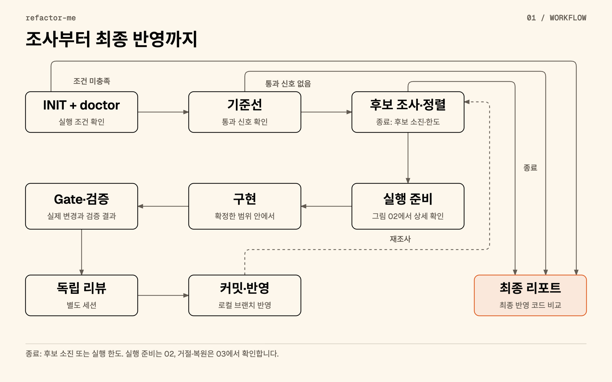
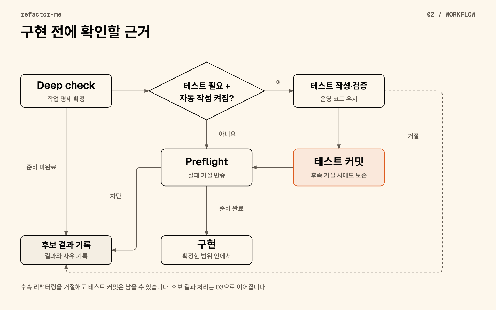
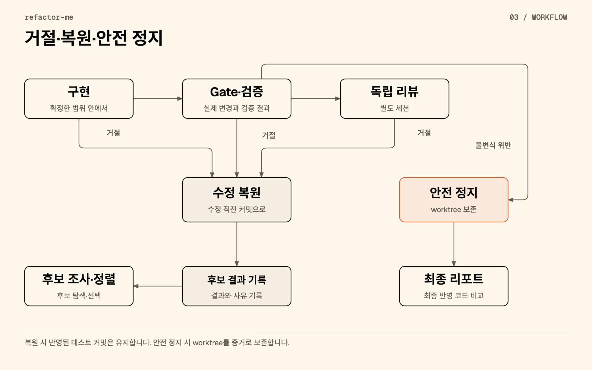

# 리팩터링 Workflow

[프로젝트](../docs/README.ko.md) · [English](WORKFLOW.md) · [상세 문서](README.ko.md) · [실행 가이드](TUTORIAL.ko.md)

후보 하나를 발견한 시점부터 최종 리포트까지 따라갑니다. 컨트롤러가 프로바이더 세션에 질문을 보내고 JSON 응답을 검사한 뒤 다음 단계로 진행할지 결정합니다. 사용자는 설정을 정하고 실행을 시작합니다. 이후 각 단계에서 사용자에게 승인을 요청하는 방식은 아닙니다.

예시는 [로컬 fixture 생성기](fixtures/make-fixture.mjs)의 `src/legacy-parser.mjs`를 삭제하는 경우입니다. 이 모듈은 `parseLegacy`와 `legacyVersion`을 내보내지만 기존 진입점에서 호출하지 않습니다. 같은 fixture의 `plugin-x`는 레지스트리가 이름으로 불러옵니다. 정적 import만 검색하면 이 참조를 놓칠 수 있습니다.

**아래 답변은 설명용 데이터입니다. 실제 프로바이더 응답이나 실행 성공 기록이 아닙니다.** JSON은 현재 [응답 스키마](src/schemas.mjs)를 따르며 영어판과 한국어판의 예시는 같습니다. 질문은 [단계별 프롬프트](src/prompts.mjs)의 의미를 요약한 것입니다.

## 전체 흐름



[HTML 원본](../docs/assets/workflow/overview.ko.html) · [원본 흐름과 대응 기록](../docs/assets/workflow/README.md)

도표는 후보 하나의 처리 경로를 보여줍니다. 컨트롤러는 작업 사이에 실행 한도와 프로바이더 상태도 확인합니다. 후보를 거절한 뒤 다시 조사하거나 설정된 조건에 따라 종료할 수 있습니다. 안전 정지 시에는 worktree를 증거로 남깁니다. 일반적인 후보 거절 시에는 해당 수정 직전의 상태로 복원합니다.

## 1. INIT, doctor와 기준선

**요청:** 사용자가 `refactor-me`를 실행하면 컨트롤러가 저장소, 설정, 프로바이더와 8개 Skill을 확인합니다. Doctor의 live probe는 각 프로바이더에 필요한 Skill이 세션에서 보이는지 묻습니다. 이 응답은 진단 근거이며 audit의 후보 JSON과는 형식이 다릅니다. `doctor --no-live-probe`만으로는 세션에서 Skill을 읽을 수 있는지 확인할 수 없습니다.

**컨트롤러 확인 → 다음 단계:** 필수 조건을 충족하지 못하면 실행을 중단합니다. 초기화가 끝나면 별도 worktree에서 기준선 명령을 실행합니다. `.refactor/commands.json`에 명령 목록을 고정하지 않았다면 자동 탐색한 명령을 사용합니다. 기준선에서는 발견한 영역의 선택된 명령을 실행하며, `GREEN`인 명령이 하나 이상 있어야 audit으로 진행합니다.

이 fixture의 `src/broken.mjs`는 읽을 수 있는 typecheck 오류를 남겨 `RED` 기준선을 설명합니다. 다른 명령이 통과 신호를 제공할 수 있습니다. 이는 fixture 설계 설명이며 이 문서를 위해 측정한 기준선 결과가 아닙니다. 이후 검증에서는 통과했던 명령이 계속 통과해야 하고, 읽을 수 있는 기존 오류에는 새 signature가 없어야 합니다. 기준선의 `TIMEOUT`, `UNRUNNABLE`, `OPAQUE` 결과는 비교 근거가 없어 후보 검증에서 제외합니다.

## 2. Audit과 후보 정렬

**컨트롤러 → audit 모델:** “범위가 제한된 동작 보존 리팩터링을 찾아라. 정적·동적 도달성, 외부 소비자, 관찰 가능한 동작과 위험도를 확인하고 추측에 의존한 후보는 제외하라.” 세션은 `sharpen-clarify`, `sharpen-review`, `sharpen-challenge`, `sharpen-assess`를 사용합니다.

**응답:** 모델은 legacy parser를 `DEAD_CODE` 후보로 제안하고 `L0_LOW`, `READY`와 참조 부재 근거를 반환합니다. Export한 함수도 사용하지 않을 수 있습니다. 다만 `EXPORTED_UNUSED`만으로 외부 소비자가 없다고 판단하지는 않습니다.

**컨트롤러 확인 → 다음 단계:** `rank`는 대상 범위, `UNKNOWN` 위험도, 허용하지 않은 위험도, `REJECT`, 이미 처리한 후보, 시도 횟수와 파일 수 한도를 확인합니다. 남은 후보는 위험도, 준비 상태, 파일 수, 후보 ID 순으로 정렬합니다. Audit의 `NEEDS_EVIDENCE`는 deep check로 진행할 수 있습니다. 선택한 후보의 시도 횟수를 기록하고, 후보가 없는 audit이 설정된 횟수만큼 반복되면 종료합니다. 기본값은 두 번입니다.

<details>
<summary>전체 JSON 응답</summary>

<!-- example: audit-success schema: audit -->
```json
{
  "schema_version": "1",
  "scan_scope": "Tracked source, tests, configuration and package surface in the fixture.",
  "rejected_count": 1,
  "notes": "Illustrative response, not a captured run. The plugin-x registry entry rules out deleting that plugin.",
  "candidates": [
    {
      "candidate_id": "dead-legacy-parser",
      "category": "DEAD_CODE",
      "title": "Remove the unreferenced legacy parser",
      "related_files": [
        "src/legacy-parser.mjs"
      ],
      "problem": "No existing entrypoint reaches this module.",
      "minimal_change": "Delete src/legacy-parser.mjs.",
      "observable_contracts": [
        "Keep the exports and behavior of src/index.mjs unchanged."
      ],
      "static_reachability": "EXPORTED_UNUSED",
      "dynamic_reachability": "NONE",
      "external_consumer_risk": "NONE",
      "ui_impact": "NONE",
      "persistence_impact": "NONE",
      "async_side_effect_impact": "NONE",
      "test_protection": "PARTIAL",
      "characterization_needed": false,
      "estimated_file_count": 1,
      "primary_symbol": "parseLegacy",
      "risk_level": "L0_LOW",
      "readiness": "READY",
      "evidence": [
        {
          "file": "src/legacy-parser.mjs",
          "locator": "parseLegacy and legacyVersion exports",
          "kind": "DEFINITION",
          "supports": "The module contains only the legacy parser and version helper."
        },
        {
          "file": "src/index.mjs",
          "locator": "Repository-wide search of imports, strings, registry entries, tests and configuration",
          "kind": "GREP_ABSENCE",
          "supports": "No reference reaches legacy-parser, parseLegacy or legacyVersion from an existing entrypoint."
        },
        {
          "file": "package.json",
          "locator": "private and entrypoint fields",
          "kind": "CONFIG",
          "supports": "The fixture has no declared public package surface."
        }
      ]
    }
  ]
}
```

</details>

## 3. Deep check와 작업 명세

**컨트롤러 → deep check 모델:** “현재 저장소의 근거로 후보를 검증하라. 최소 allowlist, 보존할 동작, 중단 조건과 필요한 characterization 테스트를 명시하라.” 세션은 `sharpen-review`와 `sharpen-challenge`를 사용합니다. 중복 제거 후보에는 `sharpen-dedupe`도 추가합니다.

**응답:** `READY`, 삭제할 파일 하나, 계약 `C1`, `characterization_needed: false`를 반환합니다.

**컨트롤러 확인 → 다음 단계:** 컨트롤러가 `fp`와 `original_lines`를 추가해 `packet.json`을 저장합니다. `READY`이고 allowlist가 비어 있지 않아야 진행합니다. 이 예시는 preflight로 넘어갑니다. 테스트를 먼저 추가하는 조건은 아래 characterization 분기에서 설명합니다.

<details>
<summary>전체 JSON 응답</summary>

<!-- example: deepcheck-success schema: deepcheck -->
```json
{
  "schema_version": "1",
  "candidate_id": "dead-legacy-parser",
  "category": "DEAD_CODE",
  "title": "Remove the unreferenced legacy parser",
  "minimal_change": "Delete src/legacy-parser.mjs.",
  "allowlist": [
    "src/legacy-parser.mjs"
  ],
  "forbidden_files": [
    "src/registry.mjs",
    "src/plugin-x.mjs"
  ],
  "contracts": [
    {
      "contract_id": "C1",
      "statement": "Existing src/index.mjs exports, return values and side effects stay unchanged.",
      "kind": "RETURN_SHAPE",
      "verified_by": "Inspect reachable imports and run the existing entrypoint tests and build."
    }
  ],
  "stop_conditions": [
    "Stop if an existing entrypoint or package consumer reaches the module.",
    "Stop if removal requires edits outside the allowlist."
  ],
  "rollback": {
    "strategy": "GIT_RESET_HARD",
    "detail": "The controller restores only the detached run worktree to its recorded pre-write commit."
  },
  "risk_level": "L0_LOW",
  "characterization_needed": false,
  "characterization_files": [],
  "readiness": "READY",
  "readiness_reason": "The fixture has no reachable consumer of this module; the existing entrypoint checks cover the retained behavior.",
  "notes": "Illustrative task packet. The controller adds fp and original_lines when saving packet.json."
}
```

</details>

## 4. Preflight



[HTML 원본](../docs/assets/workflow/preparation.ko.html) · [원본 흐름과 대응 기록](../docs/assets/workflow/README.md)

**컨트롤러 → preflight 모델:** “이 작업 명세가 실패할 수 있는 구체적인 가설을 하나 세우고, 그 가설을 반증해 보라.” 세션은 `sharpen-challenge`를 사용하며 코드 수정 없이 작업 명세, 저장소 정보와 기준선 요약을 읽습니다.

**응답:** 문자열 로더가 참조할 수 있다는 가설에 `FALSIFIED`를 반환합니다. 차단 사유는 없고 판정은 `READY_TO_EXECUTE`입니다.

**컨트롤러 확인 → 다음 단계:** 세 조건을 모두 충족해야 합니다. 모델이 `READY_TO_EXECUTE`를 적어도 가설 판정이 `SURVIVED`나 `INCONCLUSIVE`이면 실행을 차단합니다. `preflight.json`을 저장하고 조건을 확인한 뒤 구현 단계로 넘어갑니다.

<details>
<summary>전체 JSON 응답</summary>

<!-- example: preflight-success schema: preflight -->
```json
{
  "schema_version": "1",
  "candidate_id": "dead-legacy-parser",
  "verdict": "READY_TO_EXECUTE",
  "failure_hypothesis": "A string-based loader still resolves the legacy parser.",
  "falsification_method": "Inspect the registry, imports, scripts and configuration for the module path and exported symbols.",
  "falsification_result": "FALSIFIED",
  "blocking_reasons": [],
  "notes": "Illustrative evidence: registry references plugin-x, not the legacy parser."
}
```

</details>

## 5. 구현

**컨트롤러 → 구현 모델:** “확정한 작업 명세만 적용하라. Hunk별 성격을 분류하고 범위 확대가 필요하면 명시하라.” 세션은 `sharpen-refine`을 사용합니다. 중복 제거에서는 `sharpen-dedupe`도 허용합니다.

**응답:** 예시는 `deleted_files`로 삭제를 선언하고 계약 `C1`을 연결합니다. 범위 확대 없이 `PASS`를 반환합니다. 파일 삭제, Git 작업과 검증 명령 실행은 컨트롤러가 담당합니다.

**컨트롤러 확인 → 다음 단계:** `execution.json`을 저장합니다. `UNEXPLAINED`나 `CONTRACT_CHANGING` hunk, 범위 확대, 허용 범위 밖 경로 선언이 있으면 `PASS`여도 거절할 수 있습니다. 이 삭제에서는 allowlist를 확인한 뒤 컨트롤러가 파일을 지웁니다. 다음 gate에서 실제 diff를 검사합니다.

<details>
<summary>전체 JSON 응답</summary>

<!-- example: execute-success schema: execute -->
```json
{
  "schema_version": "1",
  "candidate_id": "dead-legacy-parser",
  "changed_files": [],
  "deleted_files": [
    "src/legacy-parser.mjs"
  ],
  "rationale": "Remove the module that no existing entrypoint reaches.",
  "hunks": [
    {
      "hunk_id": "H1",
      "file": "src/legacy-parser.mjs",
      "classification": "INTERNAL_ONLY",
      "justification": "The removed exports have no reachable consumer in the fixture.",
      "contract_ids": [
        "C1"
      ]
    }
  ],
  "verdict": "PASS",
  "scope_expansion_required": false,
  "scope_expansion_reason": null,
  "notes": "The controller applies the declared deletion and checks the resulting Git diff."
}
```

</details>

## 6. Diff gate와 검증

**컨트롤러 → 로컬 검사:** 이 단계에서는 모델에 질문하지 않습니다. 컨트롤러가 실제 변경을 작업 명세와 비교합니다. 허용·금지 경로, 바이너리 변경, 변경량, 유형별 규칙, 테스트 약화, 이전 tree와 원본 checkout의 상태를 확인하고 `gate.json`을 저장합니다.

**검사 결과 → 다음 단계:** `NO_OP`이면 후보를 건너뜁니다. Gate 위반이면 수정을 거절하고 되돌립니다. 안전 불변식이 깨졌다면 실행을 멈추고 증거를 보존합니다. Gate를 통과하면 검증 명령을 실행해 `validation.json`을 저장합니다. 회귀가 발생하거나 새 검증 결과를 판단할 수 없으면 리뷰 전에 후보를 거절합니다.

후보 검증은 변경된 경로별로 가장 깊은 프로젝트 영역을 선택하고, 루트 영역이 있으면 함께 실행합니다. 후보마다 발견한 모든 영역을 다시 검증하는 것은 아닙니다. 기준선은 탐색한 명령을 실행하며 도달성 검색은 저장소 전체를 확인합니다. `--target` 밖의 호출부 수정이 필요할 수 있고, 루트 명령이 선택한 디렉터리보다 넓은 범위를 검사할 수도 있습니다.

검증 후 컨트롤러는 **리뷰를 요청하기 전에** `accepted.patch`를 저장합니다. 이 파일은 리뷰 입력이며 거절된 후보에도 남을 수 있습니다. 최종 반영 여부는 `review.json`, 반영한 커밋과 최종 `changes.patch`로 확인하세요.


## 7. 독립 리뷰

**컨트롤러 → 리뷰 모델:** “작업 명세와 diff를 보고 동작을 보존했는지 판단하라.” 세션은 `sharpen-cold-review`를 사용합니다. 구현 이유는 받지만 구현 모델의 판정과 hunk 분류는 받지 않습니다. 별도 세션에서 리뷰하며, cross-provider review를 켰고 다른 프로바이더를 사용할 수 있으면 그 프로바이더를 우선합니다.

**응답:** `PASS`, `PRESERVED`, 빈 findings와 unreviewable_hunks를 반환합니다.

**컨트롤러 확인 → 다음 단계:** `review.json`을 저장합니다. `BLOCKER`가 있거나 동작 보존 평가가 `PRESERVED`가 아니면 거절합니다. 모델이 `FAIL`을 반환해도 거절하고, 수정은 구현 직전 커밋으로 복원합니다. 현재 판정 코드는 `HIGH` 항목만으로 `PASS`를 뒤집지는 않습니다. 리뷰 결과를 읽을 때는 findings도 확인해야 합니다.

<details>
<summary>전체 JSON 응답</summary>

<!-- example: review-success schema: review -->
```json
{
  "schema_version": "1",
  "candidate_id": "dead-legacy-parser",
  "verdict": "PASS",
  "behavior_preservation_assessment": "PRESERVED",
  "unreviewable_hunks": [],
  "findings": [],
  "notes": "Illustrative review: deletion is confined to the unreferenced module; existing entrypoints remain unchanged."
}
```

</details>

## 8. 커밋, 재조사와 리포트

**컨트롤러 → Git:** 커밋할 tree가 리뷰한 tree와 같은지 확인합니다. 로컬 커밋을 만든 뒤 결과 브랜치의 이전 OID가 예상값과 같을 때만 갱신하고 `state.publishedOid`를 기록합니다. 커밋을 기록한 뒤 실행 한도 안에서 audit을 다시 시작합니다. 원본 checkout이나 승인한 tree가 예상과 다르면 반영을 중단할 수 있습니다.

**최종 결과:** 종료 시 `report.json`과 선택한 언어의 `report.md`를 저장합니다. 코드 비교는 원본 저장소의 Git 객체에서 `state.baseOid`와 `state.publishedOid`를 비교합니다. Characterization 커밋도 포함하며 worktree 보존 여부나 현재 브랜치 위치에 의존하지 않습니다.

리포트에는 파일 통계와 diff 미리보기를 표시합니다. 주변 문맥은 3줄이며 미리보기는 완전한 줄 단위로 최대 200줄 또는 UTF-8 32 KiB까지 담습니다. `changes.patch`에는 전체 텍스트 patch를 저장합니다. 바이너리 본문은 생략하고 바이너리·파일 모드 변경을 메타데이터로 표시합니다. 같은 파일을 여러 커밋에서 수정했다면 최종 비교와 개별 커밋 내역은 다를 수 있습니다.

`codeComparison.status`는 `AVAILABLE`, `NO_CHANGES`, `UNAVAILABLE` 중 하나입니다. 반영한 커밋이 없으면 변경 없음으로 표시합니다. 비교 수집이나 patch 저장에 실패해도 사유만 기록하고 실행 결과와 종료 코드는 유지합니다. 과거 JSON에 `codeComparison`이 없으면 비교 미저장 안내를 표시합니다. `report --lang ko`는 새 diff 수집, 파일 변경, 모델 호출 없이 저장된 JSON을 렌더링합니다.

## 실패와 복구 분기



[HTML 원본](../docs/assets/workflow/outcomes.ko.html) · [원본 흐름과 대응 기록](../docs/assets/workflow/README.md)

### 근거 부족과 알 수 없는 위험도

Audit에서 `risk_level: "UNKNOWN"`이면 모델이 `READY`를 반환해도 `RISK_UNKNOWN`으로 제외합니다. Audit의 `NEEDS_EVIDENCE`는 deep check로 진행할 수 있습니다. Deep check에서 `READY`가 아닌 응답을 받으면 `NOT_READY`를 기록하고 코드 수정 전에 해당 후보를 멈춥니다. 다음은 그 예시입니다.

<details>
<summary>전체 JSON 응답</summary>

<!-- example: deepcheck-evidence schema: deepcheck -->
```json
{
  "schema_version": "1",
  "candidate_id": "dead-legacy-parser",
  "category": "DEAD_CODE",
  "title": "Remove the unreferenced legacy parser",
  "minimal_change": "Delete src/legacy-parser.mjs.",
  "allowlist": [
    "src/legacy-parser.mjs"
  ],
  "forbidden_files": [
    "src/registry.mjs",
    "src/plugin-x.mjs"
  ],
  "contracts": [
    {
      "contract_id": "C1",
      "statement": "Existing src/index.mjs exports, return values and side effects stay unchanged.",
      "kind": "RETURN_SHAPE",
      "verified_by": "Inspect reachable imports and run the existing entrypoint tests and build."
    }
  ],
  "stop_conditions": [
    "Stop if an existing entrypoint or package consumer reaches the module.",
    "Stop if removal requires edits outside the allowlist."
  ],
  "rollback": {
    "strategy": "GIT_RESET_HARD",
    "detail": "The controller restores only the detached run worktree to its recorded pre-write commit."
  },
  "risk_level": "L0_LOW",
  "characterization_needed": false,
  "characterization_files": [],
  "readiness": "NEEDS_EVIDENCE",
  "readiness_reason": "The available configuration does not establish whether a loader reaches the module.",
  "notes": "Alternative branch, not part of the successful fixture example."
}
```

</details>

### Preflight 차단

반론이 살아 있거나 확인할 수 없으면 구현을 시작하지 않습니다. 아래 예시는 오래된 근거 때문에 로더 가설을 `INCONCLUSIVE`로 판단합니다. 컨트롤러는 `PREFLIGHT_BLOCKED`를 기록합니다. 리팩터링은 실행하지 않았지만 앞서 반영한 characterization 커밋은 남을 수 있습니다.

<details>
<summary>전체 JSON 응답</summary>

<!-- example: preflight-blocked schema: preflight -->
```json
{
  "schema_version": "1",
  "candidate_id": "dead-legacy-parser",
  "verdict": "BLOCKED",
  "failure_hypothesis": "A string-based loader still resolves the legacy parser.",
  "falsification_method": "Inspect the registry, imports, scripts and configuration for the module path and exported symbols.",
  "falsification_result": "INCONCLUSIVE",
  "blocking_reasons": [
    {
      "code": "EVIDENCE_STALE",
      "detail": "The available registry evidence does not cover the current source snapshot.",
      "file": "src/registry.mjs"
    }
  ],
  "notes": "Alternative branch. No refactor should start with this result."
}
```

</details>

### Characterization만 반영되는 경우

Deep check의 작업 명세가 characterization을 요청하고 `policy.auto_characterization`이 켜져 있으면, 컨트롤러는 모델에 기존 계약을 확인할 테스트를 추가하도록 요청합니다. 모델은 `sharpen-clarify`와 `sharpen-challenge`를 사용하며 `characterization_files`만 수정할 수 있습니다. 아래 별도 시나리오는 진입점 테스트를 요청합니다. 사용하지 않는 모듈을 관찰하려는 목적으로 새 호출부를 만들면 안 됩니다.

<details>
<summary>전체 작업 명세 JSON</summary>

<!-- example: characterization-packet schema: deepcheck -->
```json
{
  "schema_version": "1",
  "candidate_id": "dead-legacy-parser",
  "category": "DEAD_CODE",
  "title": "Remove the unreferenced legacy parser",
  "minimal_change": "Delete src/legacy-parser.mjs.",
  "allowlist": [
    "src/legacy-parser.mjs"
  ],
  "forbidden_files": [
    "src/registry.mjs",
    "src/plugin-x.mjs"
  ],
  "contracts": [
    {
      "contract_id": "C1",
      "statement": "Existing src/index.mjs exports, return values and side effects stay unchanged.",
      "kind": "RETURN_SHAPE",
      "verified_by": "Inspect reachable imports and run the existing entrypoint tests and build."
    }
  ],
  "stop_conditions": [
    "Stop if an existing entrypoint or package consumer reaches the module.",
    "Stop if removal requires edits outside the allowlist."
  ],
  "rollback": {
    "strategy": "GIT_RESET_HARD",
    "detail": "The controller restores only the detached run worktree to its recorded pre-write commit."
  },
  "risk_level": "L0_LOW",
  "characterization_needed": true,
  "characterization_files": [
    "test/entrypoint-characterization.test.mjs"
  ],
  "readiness": "READY",
  "readiness_reason": "Reachability is established, but record the retained entrypoint return shape before deleting the module.",
  "notes": "Alternative test-protection scenario; the successful example skips characterization."
}
```

</details>

응답에는 테스트 경로와 확인한 계약을 담습니다. `PASS`만으로는 충분하지 않습니다. 컨트롤러는 운영 코드 수정, assertion 약화와 범위 밖 변경을 거절합니다. 운영 코드를 바꾸지 않은 상태에서 테스트를 실행한 뒤 별도 characterization 커밋을 만듭니다. 테스트 diff가 비어 있으면 커밋하지 않습니다. 테스트 경로가 없거나 검증에 실패하면 해당 후보를 멈춥니다. 자동 characterization을 끈 경우에는 이 테스트 작성 단계 없이 preflight로 진행합니다.

<details>
<summary>전체 JSON 응답</summary>

<!-- example: characterization-success schema: characterization -->
```json
{
  "schema_version": "1",
  "candidate_id": "dead-legacy-parser",
  "changed_files": [
    "test/entrypoint-characterization.test.mjs"
  ],
  "characterized_contracts": [
    "C1"
  ],
  "production_source_changed": false,
  "assertions_weakened": false,
  "verdict": "PASS",
  "notes": "Illustrative response. The controller must still validate the actual test diff and run it against unchanged production code."
}
```

</details>

이후 preflight 차단, 검증 회귀나 리뷰 거절이 발생하면 리팩터링 수정은 **characterization 이후**에 기록한 커밋으로 복원합니다. 테스트 커밋은 결과 브랜치에 남습니다. 따라서 리팩터링 커밋 수가 0이어도 최종 비교에는 테스트가 포함될 수 있습니다. `policy.max_commits`는 리팩터링 커밋을 별도로 셉니다.

### 검증 회귀와 리뷰 거절

기준선에서 통과했던 명령은 계속 통과해야 합니다. 읽을 수 있는 기존 실패에 새 오류 signature가 추가되면 후보를 거절합니다. 같은 오류로 실패했다고 검사를 통과한 것은 아닙니다. 타임아웃이나 실행할 수 없는 명령도 후보 승인을 막습니다. 컨트롤러는 검증 결과와 실패를 기록하고 후보의 수정 직전 커밋으로 복원합니다.

아래 별도 리뷰 예시는 동작 보존을 확인하지 못한 경우입니다. 컨트롤러는 후보를 거절하고 리팩터링 수정을 되돌립니다. 이미 저장한 `accepted.patch`는 입력 스냅샷으로 남으며 승인 결과를 뜻하지 않습니다.

<details>
<summary>전체 JSON 응답</summary>

<!-- example: review-rejected schema: review -->
```json
{
  "schema_version": "1",
  "candidate_id": "dead-legacy-parser",
  "verdict": "FAIL",
  "behavior_preservation_assessment": "CANNOT_DETERMINE",
  "unreviewable_hunks": [
    "H1"
  ],
  "findings": [
    {
      "finding_id": "R1",
      "severity": "BLOCKER",
      "file": "src/legacy-parser.mjs",
      "locator": "H1",
      "claim": "The reviewed evidence does not rule out a configured loader.",
      "why_it_matters": "Removing a reachable module would change an existing entrypoint.",
      "suggested_action": "Retain the module until the loader configuration is checked."
    }
  ],
  "notes": "Alternative branch illustrating review rejection, not a finding from the fixture."
}
```

</details>

### 스키마 복구, 타임아웃과 프로바이더 전환

| 상황 | 컨트롤러 처리 | 다음 단계 |
| --- | --- | --- |
| JSON 형식이나 스키마 오류 | 검증 오류와 이전 응답을 넣어 읽기 전용 복구를 한 번 요청 | 다시 검사하고 `SCHEMA`가 남으면 사용 가능한 다른 프로바이더에 요청 |
| `TIMEOUT` 또는 `PROCESS` 실패 | 같은 프로바이더에 5초, 그다음 20초 뒤 재시도 | 재시도를 소진하면 사용 가능한 다른 프로바이더에 요청 |
| `QUOTA` 또는 `AUTH` | 프로바이더 상태를 갱신하고 handoff 스냅샷 작성 시도 | 같은 단계에서 다른 프로바이더에 요청 |
| 치명적인 프로바이더 오류 | 복구나 전환 없이 중단 | 진단 기록을 보존하고 종료 사유 표시 |
| 해당 단계를 완료한 프로바이더 없음 | 단계별 실패 또는 프로바이더 소진 처리 | 컨트롤러 상태와 한도에 따라 실패를 기록하거나 종료 |

복구 요청도 원래 응답 스키마를 사용합니다. 별도 복구 JSON 형식은 없으며 복구 세션에서 코드 수정을 이어갈 수 없습니다. 프로세스가 성공해도 응답 스키마를 통과해야 해당 단계를 진행합니다. 실패한 프로세스와 복구 프로세스의 사용량도 집계합니다.

프로바이더를 전환하면 해당 단계의 입력으로 새 세션을 시작합니다. 이전 세션을 이어받지는 않습니다. 쓰기 단계에서 `callPhase`가 재시도나 전환 직전에 수정을 매번 되돌리는 것은 아닙니다. 실행 실패나 검사 거절에 따른 복원은 바깥의 후보 처리 코드가 담당합니다. `handoff.md`는 사람이 읽는 실행 중간 스냅샷이며 다음 프로바이더의 대화 문맥이나 최종 리포트가 아닙니다.

## 확인할 기록

| 파일 | 의미 |
| --- | --- |
| `audits/*.json` | Audit이 반환한 후보 목록 |
| `cycles/*/packet.json` | 작업 명세와 컨트롤러 메타데이터 |
| `cycles/*/preflight.json` | 실패 가설과 반증 결과 |
| `cycles/*/execution.json` | 구현 응답과 프로바이더 |
| `cycles/*/gate.json`, `validation.json`, `review.json` | 해당 사이클의 범위 검사, 실행한 검증과 리뷰 근거 |
| `cycles/*/accepted.patch` | 리뷰에 제출한 diff. 나중에 거절한 후보에도 남을 수 있음 |
| `state.json` | 종료 상태, 카운터와 최종 반영 커밋 OID |
| `report.json`, `report.md`, `changes.patch` | 최종 리포트와 커밋된 텍스트 비교. 비교 불가 시 사유 기록 |

경로는 `.refactor/runs/<id>/` 기준입니다. 실제 사이클 디렉터리명에는 유형과 fingerprint가 들어갑니다. 상태, 비용과 종료 코드의 제약은 [상세 문서](README.ko.md)를, 병합 전 검토는 [실행 가이드](TUTORIAL.ko.md)를 확인하세요. 로컬 테스트는 스키마와 컨트롤러 동작을 검사하며 실제 모델의 판단 품질을 측정하지는 않습니다.
