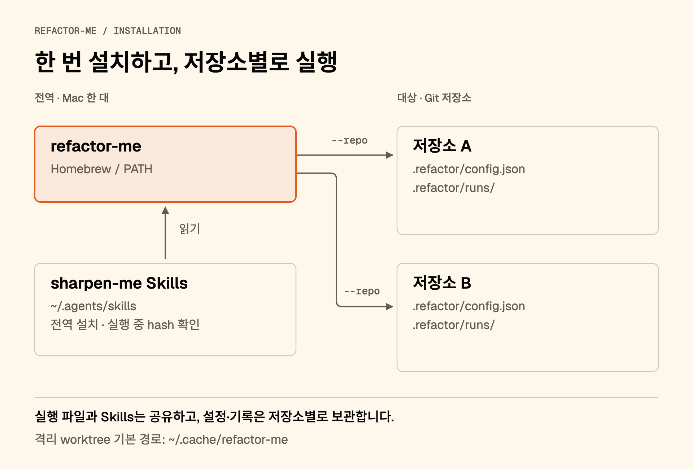
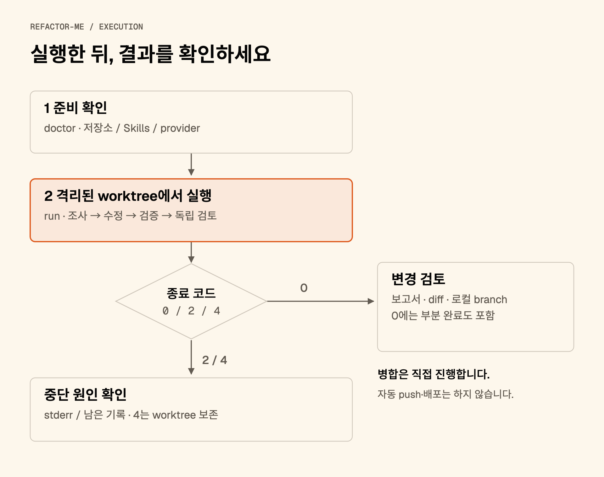

# 리팩토링 실행 과정

[프로젝트](../docs/README.ko.md) · [English](WORKFLOW.md) · [사용법](TUTORIAL.ko.md) · [명령·설정](README.ko.md)

실행 제한을 설정하고 `run`을 시작하면 단계마다 승인하지 않아도 컨트롤러가 검사와 실행을 이어갑니다. 코드는 격리된 Git worktree에서 수정하며, 통과한 커밋을 로컬 결과 branch에 발행합니다.

공개 Beta `0.10.0-beta.4`에서는 모델을 호출하기 전에 primary와 fallback provider마다 모델을 선택합니다. 명령의 모델 옵션이 프로젝트 설정보다 우선하며 해당 명령에만 적용됩니다. 추론 수준 옵션은 선택한 provider의 모든 단계에 적용하고, 생략하면 기존 단계 정책을 유지합니다. [모델과 추론 수준 선택](README.ko.md#model-and-effort-selection)을 참고하세요.

## 전역 설치와 프로젝트별 상태



`--repo`는 실행 파일의 위치와 관계없이 대상 저장소를 선택합니다. 저장소마다 `.refactor` 설정, 잠금, 실행 기록이 따로 있습니다. worktree의 기본 상위 경로는 `~/.cache/refactor-me`입니다.

Codex에는 선택한 전역 Skill의 절대 경로를 전달합니다. Claude에는 실행별 `.claude/skills` 복사본을 `--add-dir`로 제공하며, 프로젝트 설정만 읽도록 하고 도구·MCP 접근을 제한합니다. provider 호출 전후 원본과 복사본의 hash를 확인하고, 예상하지 못한 변경이 있으면 결과 발행을 중단합니다. 자세한 내용은 [Skill 해석](README.ko.md#skill-availability)을 참고하세요.

## 검사부터 로컬 branch 발행까지



| 단계 | 통과 조건 | 저장하는 근거 |
| --- | --- | --- |
| 준비 | 깨끗한 원본, 유효한 전역 Skills, 선택한 모델, 사용 가능한 provider, 기준선 명령 하나 이상 통과 | doctor와 기준선 결과 |
| 후보 선택 | 조사 범위·위험·시도 이력 확인, deep check에서 실행 가능한 작업 명세 확정 | `audits/`, `packet.json` |
| 수정 | 필요하면 characterization 테스트 추가, preflight 통과, 명세 범위 안에서 실행 | `preflight.json`, `execution.json` |
| 검증·검토 | diff 검사, 검증 결과 악화 없음, 별도 세션 검토 통과 | `gate.json`, `validation.json`, `review.json` |
| 발행·반복 | 검토한 tree와 커밋 tree 일치, 원본 불변, 결과 ref의 이전 OID 일치 | `state.json`, 최종 보고서 |

characterization은 소스를 수정하기 전에 기존 동작을 테스트로 기록하는 단계입니다. 활성화하면 변경 전 소스에서 테스트를 통과해야 하며 별도 커밋을 만들 수 있습니다. 이후 리팩토링이 거부되어도 이 테스트 커밋은 결과 branch에 남을 수 있습니다. `max_commits`는 리팩토링 커밋만 계산합니다.

개발 빌드는 실제 기준선 결과를 deep check, characterization, preflight, execution에 전달합니다. characterization 커밋을 만들면 preflight와 execution에 해당 커밋, 파일, 검증 결과도 전달합니다. 테스트 생성 전의 파일명 충돌 조건은 이 단계에서 새로 만들었다고 기록된 파일에만 예외를 적용하며, 기존 파일의 충돌 조건은 유지합니다. 근거가 없으면 미확인으로 남기며 기존 기준선 실패는 그대로 실패로 표시합니다. characterization 검사는 `cycles/*/characterization-validation.json`에 저장합니다.

execution 지침은 줄바꿈과 파일 끝의 빈 줄을 포함해 관련 없는 바이트를 보존하도록 요구합니다. 편집 도구가 같은 허용 소스 파일에 부수적인 공백 변경을 만들면 최종 diff를 판정하기 전에 한 번 바로잡을 수 있습니다. 남은 불일치, 범위 확장, 동작 변경은 여전히 후보를 거부하는 사유입니다. 수정 후 검증은 컨트롤러가 담당합니다.

preflight는 `READY_TO_EXECUTE`, 실패 가설의 `FALSIFIED`, 차단 이유 없음이라는 세 조건을 충족해야 합니다. 실행 중 명세 범위를 넓힐 수 없습니다. 컨트롤러는 실제 diff에서 경로, 파일·줄 수 제한, 테스트 약화, 바이너리, 반복된 tree를 검사합니다.

검토는 별도 세션에서 진행하며 설정에 따라 다른 가용 provider를 우선합니다. `FAIL`, `BLOCKER`, 또는 `PRESERVED` 이외의 평가는 변경을 거부합니다. `HIGH` 지적만으로는 `PASS`를 뒤집지 않으므로 병합 전에 지적 내용을 읽어야 합니다.

커밋 hook도 실행합니다. hook이 검토한 tree를 바꾸거나 작업 변경을 남기면 `HALTED_UNSAFE`로 발행을 중단합니다. 결과 branch 갱신 시 이전 OID를 확인하므로 다른 갱신과 충돌해도 발행하지 않습니다.

### 확인된 상태를 안내하는 진행 로그

공개 Beta `0.10.0-beta.4`는 `--lang en|ko`로 위 단계의 안내 언어를 선택하며 기본값은 영어입니다. 컨트롤러는 실제 단계가 시작되거나 끝날 때 안내하며 shell 명령에서 작업 목적을 추측하지 않습니다. 조사할 때마다 제안된 수와 진행 가능한 수를 알리고, 한도가 적용되면 확인한 수도 표시합니다. 수락한 변경 이후에 다시 조사하므로 전체 후보 수나 완료율을 고정하지 않습니다.

검증 안내에는 명령 이름과 영역을 표시합니다. 기준선은 실제 실행 상태를, 변경 후에는 기준선과 비교한 최종 판정을 알립니다. 기존과 같은 실패는 통과가 아닙니다. 정책 제외, 구현 거절과 변경 없음은 각각 구분합니다. 복원에 성공해야 되돌리기 완료를 알리고, 로컬 branch 반영과 state 저장이 끝나야 커밋 완료를 알립니다.

긴 단계에서는 30초마다 단계 이름과 경과 시간을 출력하고 단계 종료나 명령 반환 전에 이 안내를 중단합니다. `run --json`에서도 모든 진행 로그는 `stderr`로 출력하며 provider와 도구 원문은 로컬 기록에 보존합니다. `stdout`에는 보고서 JSON만 출력합니다. 기존 복구 정책을 유지하면서 schema 복구, 권한 거절, 재시도와 provider 전환을 안내합니다. 자세한 내용은 [진행 로그](README.ko.md#progress-logs)를 참고하세요.

## 검증 범위

기준선은 탐지한 영역의 명령 또는 `.refactor/commands.json`에 고정한 명령으로 검사합니다. 명령 하나 이상이 통과해야 후보 조사를 시작합니다.

수정 후에는 각 경로의 가장 깊은 대상 영역과 루트 영역이 있으면 함께 검사합니다. 통과하던 명령은 계속 통과해야 합니다. 오류 내용을 비교할 수 있는 기존 실패에는 새 오류가 추가되면 안 되며, 같은 오류가 남아 있어도 실패로 기록합니다. 기준선이 `TIMEOUT`, `UNRUNNABLE`, `OPAQUE`인 명령은 생략합니다.

`--target`은 후보 조사 범위입니다. 참조 관계는 저장소 전체를 확인하며 호출부 수정은 target 밖까지 이어질 수 있습니다. 생략한 브라우저·서비스·통합 테스트는 병합 전에 별도로 확인해야 합니다.

## 거부, 재시도, 중단

| 상황 | 컨트롤러 처리 |
| --- | --- |
| 위험 판단 불가 | 기본값은 보류. `unknown_risk: deep_check`는 `UNKNOWN` + `NEEDS_EVIDENCE`만 허용하며 최종 명세는 다시 위험 정책 검사 |
| diff·검증·검토 거부 | 도구 소유 worktree에서 해당 후보의 수정을 되돌리고, 앞서 수락한 커밋은 보존 |
| 잘못된 JSON 또는 응답 schema | 읽기 전용 복구 한 번 시도. 다시 `SCHEMA` 오류이면 다른 가용 provider 시도 |
| timeout 또는 프로세스 실패 | 5초, 20초 뒤 재시도 후 다른 가용 provider 시도. timeout은 프로세스 그룹에 SIGTERM을 보내고 유예 후 SIGKILL |
| 사용량 소진 또는 인증 실패 | provider 상태를 기록하고 handoff 시도 후 다른 가용 provider로 같은 단계 계속 |

복구할 수 없는 provider 오류는 실행을 중단합니다. 가용 provider 소진, cycle·커밋·시간 제한, 연속 실패, 충분한 횟수의 빈 조사 결과도 종료 조건입니다. 안전 조건 위반 시에는 조사할 수 있도록 worktree를 보존합니다.

provider를 바꾸면 단계 입력을 전달한 새 세션을 시작합니다. 이전 대화를 이어받지는 않습니다. 쓰기 단계의 재시도마다 worktree를 복구하는 것은 아니며, 후보 거부나 실패 처리에서 되돌립니다. `handoff.md`는 중간 기록으로, 다음 세션의 문맥이나 최종 보고서가 아닙니다.

## 최종 근거 확인

아래 경로는 `.refactor/runs/<id>/`를 기준으로 합니다.

| 파일 | 용도 |
| --- | --- |
| `report.md`, `report.json` | 결과, 중단 이유, 검증, 사용량 |
| `changes.patch` | 기록된 시작 커밋부터 마지막 발행 커밋까지의 순수 텍스트 변경 |
| `state.json` | 카운터, 종료 상태, worktree, 발행 OID |
| `audits/<cycle>/`, `cycles/*/` | 프롬프트, 응답, 작업 명세, 단계별 검사 |
| `cycles/*/accepted.patch` | 검토에 제출한 diff. 거부된 후보의 자료일 수도 있음 |

비교 자료를 만들지 못하면 `UNAVAILABLE`로 이유를 기록하며 실행 종료 코드는 바꾸지 않습니다. 보고서 조회도 diff를 다시 수집하지 않습니다. 종료 코드 `0`에는 부분 완료가 포함되므로 병합 전에 [결과를 확인](TUTORIAL.ko.md#read-the-result)하세요.

worktree에는 로컬 환경 파일 등 Git이 무시하는 빌드 입력을 복사할 수 있습니다. 원본 저장소와 같은 접근 통제를 worktree와 실행 기록에도 적용하세요.

## Provider 응답 예시

부록은 [선택적 JavaScript fixture](fixtures/README.ko.md#optional-javascript-example)에서 참조되지 않는 모듈을 삭제하는 예시입니다. 현재 지원하는 대상 언어의 예제이며 CLI의 Node 구현이 아닙니다. 실제 모델 응답이나 성공 기록으로 제시한 자료도 아닙니다.

Go 테스트는 예시 10개를 [응답 schema](go/internal/engine/schemas.json)로 검사합니다. 단계별 지침은 [프롬프트 template](go/internal/engine/templates/)에 있습니다. 두 언어의 JSON은 동일하며, 여기의 `schema_version: "1"`은 설정 schema 2, 보고서 schema 3과 별개입니다.

<details>
<summary>schema 검사를 받는 예시 펼치기</summary>

### audit-success

<!-- example: audit-success schema: audit -->
```json
{
  "schema_version": "1",
  "scan_scope": "Tracked source, tests, configuration and package surface in the fixture.",
  "rejected_count": 1,
  "notes": "Illustrative response, not a captured run. The plugin-x registry entry rules out deleting that plugin.",
  "candidates": [
    {
      "candidate_id": "dead-legacy-parser",
      "category": "DEAD_CODE",
      "title": "Remove the unreferenced legacy parser",
      "related_files": [
        "src/legacy-parser.mjs"
      ],
      "problem": "No existing entrypoint reaches this module.",
      "minimal_change": "Delete src/legacy-parser.mjs.",
      "observable_contracts": [
        "Keep the exports and behavior of src/index.mjs unchanged."
      ],
      "static_reachability": "EXPORTED_UNUSED",
      "dynamic_reachability": "NONE",
      "external_consumer_risk": "NONE",
      "ui_impact": "NONE",
      "persistence_impact": "NONE",
      "async_side_effect_impact": "NONE",
      "test_protection": "PARTIAL",
      "characterization_needed": false,
      "estimated_file_count": 1,
      "primary_symbol": "parseLegacy",
      "risk_level": "L0_LOW",
      "readiness": "READY",
      "evidence": [
        {
          "file": "src/legacy-parser.mjs",
          "locator": "parseLegacy and legacyVersion exports",
          "kind": "DEFINITION",
          "supports": "The module contains only the legacy parser and version helper."
        },
        {
          "file": "src/index.mjs",
          "locator": "Repository-wide search of imports, strings, registry entries, tests and configuration",
          "kind": "GREP_ABSENCE",
          "supports": "No reference reaches legacy-parser, parseLegacy or legacyVersion from an existing entrypoint."
        },
        {
          "file": "package.json",
          "locator": "private and entrypoint fields",
          "kind": "CONFIG",
          "supports": "The fixture has no declared public package surface."
        }
      ]
    }
  ]
}
```

### deepcheck-success

<!-- example: deepcheck-success schema: deepcheck -->
```json
{
  "schema_version": "1",
  "candidate_id": "dead-legacy-parser",
  "category": "DEAD_CODE",
  "title": "Remove the unreferenced legacy parser",
  "minimal_change": "Delete src/legacy-parser.mjs.",
  "allowlist": [
    "src/legacy-parser.mjs"
  ],
  "forbidden_files": [
    "src/registry.mjs",
    "src/plugin-x.mjs"
  ],
  "contracts": [
    {
      "contract_id": "C1",
      "statement": "Existing src/index.mjs exports, return values and side effects stay unchanged.",
      "kind": "RETURN_SHAPE",
      "verified_by": "Inspect reachable imports and run the existing entrypoint tests and build."
    }
  ],
  "stop_conditions": [
    "Stop if an existing entrypoint or package consumer reaches the module.",
    "Stop if removal requires edits outside the allowlist."
  ],
  "rollback": {
    "strategy": "GIT_RESET_HARD",
    "detail": "The controller restores only the detached run worktree to its recorded pre-write commit."
  },
  "risk_level": "L0_LOW",
  "characterization_needed": false,
  "characterization_files": [],
  "readiness": "READY",
  "readiness_reason": "The fixture has no reachable consumer of this module; the existing entrypoint checks cover the retained behavior.",
  "notes": "Illustrative task packet. The controller adds fp and original_lines when saving packet.json."
}
```

### preflight-success

<!-- example: preflight-success schema: preflight -->
```json
{
  "schema_version": "1",
  "candidate_id": "dead-legacy-parser",
  "verdict": "READY_TO_EXECUTE",
  "failure_hypothesis": "A string-based loader still resolves the legacy parser.",
  "falsification_method": "Inspect the registry, imports, scripts and configuration for the module path and exported symbols.",
  "falsification_result": "FALSIFIED",
  "blocking_reasons": [],
  "notes": "Illustrative evidence: registry references plugin-x, not the legacy parser."
}
```

### execute-success

<!-- example: execute-success schema: execute -->
```json
{
  "schema_version": "1",
  "candidate_id": "dead-legacy-parser",
  "changed_files": [],
  "deleted_files": [
    "src/legacy-parser.mjs"
  ],
  "rationale": "Remove the module that no existing entrypoint reaches.",
  "hunks": [
    {
      "hunk_id": "H1",
      "file": "src/legacy-parser.mjs",
      "classification": "INTERNAL_ONLY",
      "justification": "The removed exports have no reachable consumer in the fixture.",
      "contract_ids": [
        "C1"
      ]
    }
  ],
  "verdict": "PASS",
  "scope_expansion_required": false,
  "scope_expansion_reason": null,
  "notes": "The controller applies the declared deletion and checks the resulting Git diff."
}
```

### review-success

<!-- example: review-success schema: review -->
```json
{
  "schema_version": "1",
  "candidate_id": "dead-legacy-parser",
  "verdict": "PASS",
  "behavior_preservation_assessment": "PRESERVED",
  "unreviewable_hunks": [],
  "findings": [],
  "notes": "Illustrative review: deletion is confined to the unreferenced module; existing entrypoints remain unchanged."
}
```

### deepcheck-evidence

<!-- example: deepcheck-evidence schema: deepcheck -->
```json
{
  "schema_version": "1",
  "candidate_id": "dead-legacy-parser",
  "category": "DEAD_CODE",
  "title": "Remove the unreferenced legacy parser",
  "minimal_change": "Delete src/legacy-parser.mjs.",
  "allowlist": [
    "src/legacy-parser.mjs"
  ],
  "forbidden_files": [
    "src/registry.mjs",
    "src/plugin-x.mjs"
  ],
  "contracts": [
    {
      "contract_id": "C1",
      "statement": "Existing src/index.mjs exports, return values and side effects stay unchanged.",
      "kind": "RETURN_SHAPE",
      "verified_by": "Inspect reachable imports and run the existing entrypoint tests and build."
    }
  ],
  "stop_conditions": [
    "Stop if an existing entrypoint or package consumer reaches the module.",
    "Stop if removal requires edits outside the allowlist."
  ],
  "rollback": {
    "strategy": "GIT_RESET_HARD",
    "detail": "The controller restores only the detached run worktree to its recorded pre-write commit."
  },
  "risk_level": "L0_LOW",
  "characterization_needed": false,
  "characterization_files": [],
  "readiness": "NEEDS_EVIDENCE",
  "readiness_reason": "The available configuration does not establish whether a loader reaches the module.",
  "notes": "Alternative branch, not part of the successful fixture example."
}
```

### preflight-blocked

<!-- example: preflight-blocked schema: preflight -->
```json
{
  "schema_version": "1",
  "candidate_id": "dead-legacy-parser",
  "verdict": "BLOCKED",
  "failure_hypothesis": "A string-based loader still resolves the legacy parser.",
  "falsification_method": "Inspect the registry, imports, scripts and configuration for the module path and exported symbols.",
  "falsification_result": "INCONCLUSIVE",
  "blocking_reasons": [
    {
      "code": "EVIDENCE_STALE",
      "detail": "The available registry evidence does not cover the current source snapshot.",
      "file": "src/registry.mjs"
    }
  ],
  "notes": "Alternative branch. No refactor should start with this result."
}
```

### characterization-packet

<!-- example: characterization-packet schema: deepcheck -->
```json
{
  "schema_version": "1",
  "candidate_id": "dead-legacy-parser",
  "category": "DEAD_CODE",
  "title": "Remove the unreferenced legacy parser",
  "minimal_change": "Delete src/legacy-parser.mjs.",
  "allowlist": [
    "src/legacy-parser.mjs"
  ],
  "forbidden_files": [
    "src/registry.mjs",
    "src/plugin-x.mjs"
  ],
  "contracts": [
    {
      "contract_id": "C1",
      "statement": "Existing src/index.mjs exports, return values and side effects stay unchanged.",
      "kind": "RETURN_SHAPE",
      "verified_by": "Inspect reachable imports and run the existing entrypoint tests and build."
    }
  ],
  "stop_conditions": [
    "Stop if an existing entrypoint or package consumer reaches the module.",
    "Stop if removal requires edits outside the allowlist."
  ],
  "rollback": {
    "strategy": "GIT_RESET_HARD",
    "detail": "The controller restores only the detached run worktree to its recorded pre-write commit."
  },
  "risk_level": "L0_LOW",
  "characterization_needed": true,
  "characterization_files": [
    "test/entrypoint-characterization.test.mjs"
  ],
  "readiness": "READY",
  "readiness_reason": "Reachability is established, but record the retained entrypoint return shape before deleting the module.",
  "notes": "Alternative test-protection scenario; the successful example skips characterization."
}
```

### characterization-success

<!-- example: characterization-success schema: characterization -->
```json
{
  "schema_version": "1",
  "candidate_id": "dead-legacy-parser",
  "changed_files": [
    "test/entrypoint-characterization.test.mjs"
  ],
  "characterized_contracts": [
    "C1"
  ],
  "production_source_changed": false,
  "assertions_weakened": false,
  "verdict": "PASS",
  "notes": "Illustrative response. The controller must still validate the actual test diff and run it against unchanged production code."
}
```

### review-rejected

<!-- example: review-rejected schema: review -->
```json
{
  "schema_version": "1",
  "candidate_id": "dead-legacy-parser",
  "verdict": "FAIL",
  "behavior_preservation_assessment": "CANNOT_DETERMINE",
  "unreviewable_hunks": [
    "H1"
  ],
  "findings": [
    {
      "finding_id": "R1",
      "severity": "BLOCKER",
      "file": "src/legacy-parser.mjs",
      "locator": "H1",
      "claim": "The reviewed evidence does not rule out a configured loader.",
      "why_it_matters": "Removing a reachable module would change an existing entrypoint.",
      "suggested_action": "Retain the module until the loader configuration is checked."
    }
  ],
  "notes": "Alternative branch illustrating review rejection, not a finding from the fixture."
}
```

</details>
