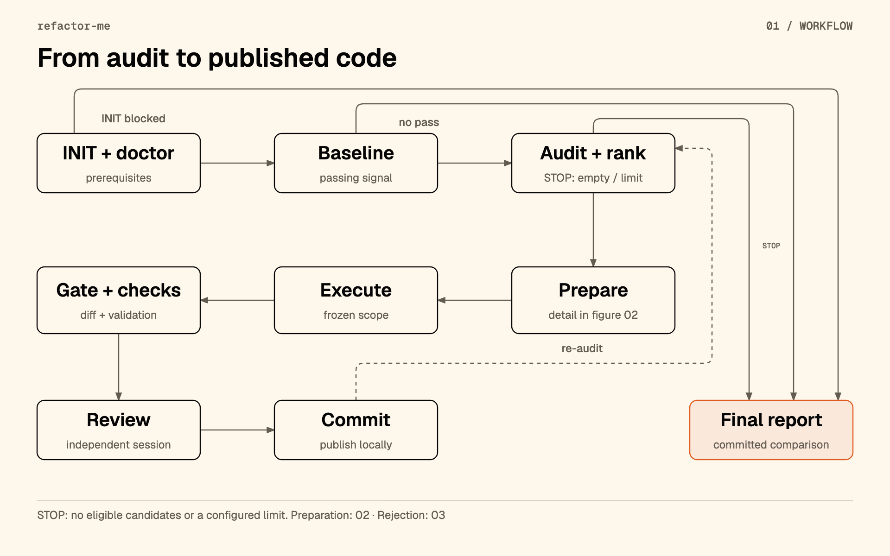
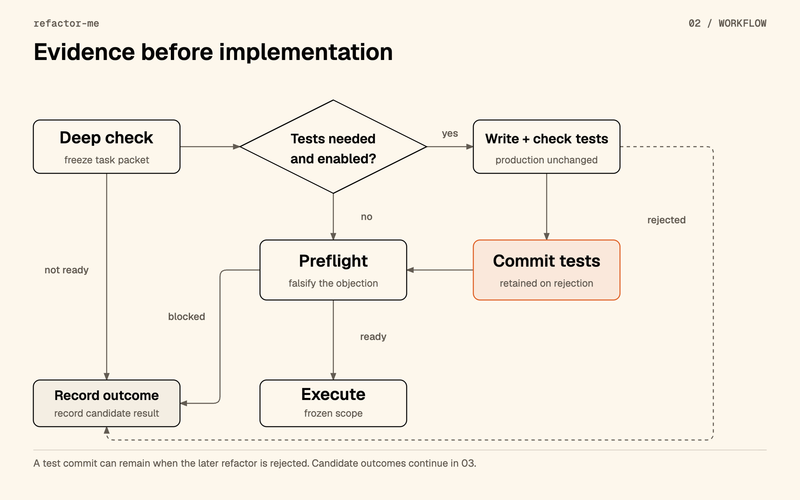
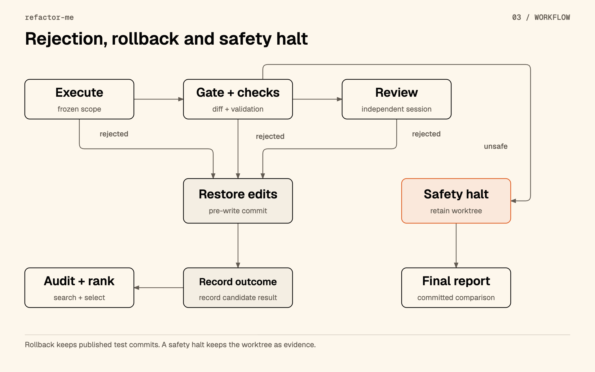

# Refactoring workflow

[Project](../README.md) · [한국어](WORKFLOW.ko.md) · [Reference](README.md) · [Guide](TUTORIAL.md)

This document follows one candidate from discovery to the final report. The controller sends the questions to a provider session, validates its JSON response, and decides whether to proceed. The operator starts the run with a configuration; the loop does not ask the operator to approve each phase.

The example removes `src/legacy-parser.mjs` from the [local fixture generator](fixtures/make-fixture.mjs). That module exports `parseLegacy` and `legacyVersion` without a reachable caller. The fixture also contains `plugin-x`, which a registry loads by name; a search of static imports alone would miss it.

**The answers below are illustrative data, not captured provider output or proof of a successful live run.** The JSON follows the current [response schemas](src/schemas.mjs). English and Korean editions use identical response examples. The questions summarize the [phase prompts](src/prompts.mjs); they do not replace them.

## Flow



[HTML source](../docs/assets/workflow/overview.en.html) · [Source and fidelity record](../docs/assets/workflow/README.md)

The diagram shows the candidate path. The controller also checks run limits and provider availability between units of work. A rejected candidate can lead to another audit or a configured stop. A safety halt preserves the worktree; an ordinary candidate rejection restores its recorded pre-write state.

## 1. INIT, doctor and baseline

**Request:** The operator starts `refactor-me`; the controller checks the repository, configuration, provider availability and all eight skills. Its live doctor probe asks each provider which required skills the session can see. The response is diagnostic evidence, not an audit candidate JSON. A disk-only `doctor --no-live-probe` does not establish session visibility.

**Controller check → next step:** Blocking prerequisites abort the run. After initialization, the controller runs baseline commands in the detached worktree. Discovery supplies the commands unless `.refactor/commands.json` locks an explicit list. The baseline attempts the selected commands across discovered areas; at least one must be `GREEN` to proceed to audit.

In this fixture, a readable typecheck failure in `src/broken.mjs` demonstrates the `RED` baseline path. Other commands can provide the passing signal. This is an explanation of the fixture design, not a measured baseline for this document. Later validation must preserve passing checks and introduce no new error signatures for readable failures. `TIMEOUT`, `UNRUNNABLE` and `OPAQUE` baseline results provide no comparison signal and are excluded from the candidate ladder.

## 2. Audit and candidate ranking

**Controller → audit model:** “Find a bounded behavior-preserving refactor. Check static and dynamic reachability, external consumers, observable contracts and risk. Reject speculative candidates.” The session uses `sharpen-clarify`, `sharpen-review`, `sharpen-challenge` and `sharpen-assess`.

**Response:** The model proposes `DEAD_CODE` for the legacy parser, with `L0_LOW`, `READY` and evidence of absent references. An exported function can still be unused; `EXPORTED_UNUSED` alone does not prove that a public consumer is absent.

**Controller check → next step:** `rank` filters target scope, `UNKNOWN` risk, disallowed risk, `REJECT` readiness, seen candidates, exhausted attempts and file limits. It orders eligible candidates by risk, readiness, file count and candidate ID. Audit readiness `NEEDS_EVIDENCE` can still reach deep check. The selected candidate starts one attempt; repeated empty audits stop at the configured threshold, which defaults to two.

<details>
<summary>Full JSON response</summary>

<!-- example: audit-success schema: audit -->
```json
{
  "schema_version": "1",
  "scan_scope": "Tracked source, tests, configuration and package surface in the fixture.",
  "rejected_count": 1,
  "notes": "Illustrative response, not a captured run. The plugin-x registry entry rules out deleting that plugin.",
  "candidates": [
    {
      "candidate_id": "dead-legacy-parser",
      "category": "DEAD_CODE",
      "title": "Remove the unreferenced legacy parser",
      "related_files": [
        "src/legacy-parser.mjs"
      ],
      "problem": "No existing entrypoint reaches this module.",
      "minimal_change": "Delete src/legacy-parser.mjs.",
      "observable_contracts": [
        "Keep the exports and behavior of src/index.mjs unchanged."
      ],
      "static_reachability": "EXPORTED_UNUSED",
      "dynamic_reachability": "NONE",
      "external_consumer_risk": "NONE",
      "ui_impact": "NONE",
      "persistence_impact": "NONE",
      "async_side_effect_impact": "NONE",
      "test_protection": "PARTIAL",
      "characterization_needed": false,
      "estimated_file_count": 1,
      "primary_symbol": "parseLegacy",
      "risk_level": "L0_LOW",
      "readiness": "READY",
      "evidence": [
        {
          "file": "src/legacy-parser.mjs",
          "locator": "parseLegacy and legacyVersion exports",
          "kind": "DEFINITION",
          "supports": "The module contains only the legacy parser and version helper."
        },
        {
          "file": "src/index.mjs",
          "locator": "Repository-wide search of imports, strings, registry entries, tests and configuration",
          "kind": "GREP_ABSENCE",
          "supports": "No reference reaches legacy-parser, parseLegacy or legacyVersion from an existing entrypoint."
        },
        {
          "file": "package.json",
          "locator": "private and entrypoint fields",
          "kind": "CONFIG",
          "supports": "The fixture has no declared public package surface."
        }
      ]
    }
  ]
}
```

</details>

## 3. Deep check and the task packet

**Controller → deep-check model:** “Verify the candidate against current repository evidence. Name the smallest allowlist, preserved contracts, stop conditions and any characterization tests needed.” The session uses `sharpen-review` and `sharpen-challenge`; deduplication candidates also use `sharpen-dedupe`.

**Response:** `READY`, one allowed deletion, contract `C1`, and `characterization_needed: false`.

**Controller check → next step:** Save `packet.json` with controller-added `fp` and `original_lines`. Readiness must be `READY` and the allowlist must be nonempty. This example proceeds to preflight. The characterization branch below explains when the controller creates tests first.

<details>
<summary>Full JSON response</summary>

<!-- example: deepcheck-success schema: deepcheck -->
```json
{
  "schema_version": "1",
  "candidate_id": "dead-legacy-parser",
  "category": "DEAD_CODE",
  "title": "Remove the unreferenced legacy parser",
  "minimal_change": "Delete src/legacy-parser.mjs.",
  "allowlist": [
    "src/legacy-parser.mjs"
  ],
  "forbidden_files": [
    "src/registry.mjs",
    "src/plugin-x.mjs"
  ],
  "contracts": [
    {
      "contract_id": "C1",
      "statement": "Existing src/index.mjs exports, return values and side effects stay unchanged.",
      "kind": "RETURN_SHAPE",
      "verified_by": "Inspect reachable imports and run the existing entrypoint tests and build."
    }
  ],
  "stop_conditions": [
    "Stop if an existing entrypoint or package consumer reaches the module.",
    "Stop if removal requires edits outside the allowlist."
  ],
  "rollback": {
    "strategy": "GIT_RESET_HARD",
    "detail": "The controller restores only the detached run worktree to its recorded pre-write commit."
  },
  "risk_level": "L0_LOW",
  "characterization_needed": false,
  "characterization_files": [],
  "readiness": "READY",
  "readiness_reason": "The fixture has no reachable consumer of this module; the existing entrypoint checks cover the retained behavior.",
  "notes": "Illustrative task packet. The controller adds fp and original_lines when saving packet.json."
}
```

</details>

## 4. Preflight



[HTML source](../docs/assets/workflow/preparation.en.html) · [Source and fidelity record](../docs/assets/workflow/README.md)

**Controller → preflight model:** “State the strongest concrete failure hypothesis for this packet and try to falsify it.” The session uses `sharpen-challenge` and reads the packet, repository facts and baseline summary without editing code.

**Response:** The proposed string-loader objection is `FALSIFIED`; there are no blocking reasons and the verdict is `READY_TO_EXECUTE`.

**Controller check → next step:** All three conditions must hold. `SURVIVED` or `INCONCLUSIVE` blocks execution even if the model writes `READY_TO_EXECUTE`. Save `preflight.json` and proceed to execution only after this check.

<details>
<summary>Full JSON response</summary>

<!-- example: preflight-success schema: preflight -->
```json
{
  "schema_version": "1",
  "candidate_id": "dead-legacy-parser",
  "verdict": "READY_TO_EXECUTE",
  "failure_hypothesis": "A string-based loader still resolves the legacy parser.",
  "falsification_method": "Inspect the registry, imports, scripts and configuration for the module path and exported symbols.",
  "falsification_result": "FALSIFIED",
  "blocking_reasons": [],
  "notes": "Illustrative evidence: registry references plugin-x, not the legacy parser."
}
```

</details>

## 5. Execute

**Controller → implementation model:** “Apply only the frozen packet. Classify each hunk and declare any required scope expansion.” The session uses `sharpen-refine`; deduplication also allows `sharpen-dedupe`.

**Response:** The example declares the deletion in `deleted_files`, associates it with `C1`, and returns `PASS` without scope expansion. The controller owns file deletion, Git operations and validation commands.

**Controller check → next step:** Save `execution.json`. `UNEXPLAINED` or `CONTRACT_CHANGING` hunks, scope expansion, or claimed paths outside the permitted scope can override `PASS`. For this deletion, the controller checks the allowlist before removing the file. It then examines the actual diff at the gate.

<details>
<summary>Full JSON response</summary>

<!-- example: execute-success schema: execute -->
```json
{
  "schema_version": "1",
  "candidate_id": "dead-legacy-parser",
  "changed_files": [],
  "deleted_files": [
    "src/legacy-parser.mjs"
  ],
  "rationale": "Remove the module that no existing entrypoint reaches.",
  "hunks": [
    {
      "hunk_id": "H1",
      "file": "src/legacy-parser.mjs",
      "classification": "INTERNAL_ONLY",
      "justification": "The removed exports have no reachable consumer in the fixture.",
      "contract_ids": [
        "C1"
      ]
    }
  ],
  "verdict": "PASS",
  "scope_expansion_required": false,
  "scope_expansion_reason": null,
  "notes": "The controller applies the declared deletion and checks the resulting Git diff."
}
```

</details>

## 6. Diff gate and validation

**Controller → local checks:** No model question runs here. The controller compares the actual changes with the packet: allowed and forbidden paths, binary changes, change size, category rules, test weakening, previously seen trees, and source-checkout integrity. It saves `gate.json`.

**Check results → next step:** `NO_OP` skips the candidate. A gate violation rejects and rolls back the edits; an unsafe invariant stops the run and retains evidence. For a passing gate, the controller executes the validation ladder and saves `validation.json`. A regression or an unusable new validation result rejects the candidate before review.

The ladder selects the deepest affected project area for each changed path and the root area when one exists. It does not rerun every discovered area for every candidate. The baseline attempted the discovered commands; reachability searches still cover the repository. A candidate can require caller changes outside `--target`, and root commands may cover more code than the selected directories.

After validation, the controller writes `accepted.patch` **before asking the reviewer**. Despite its name, this file is review input and can remain after rejection. Use `review.json`, the published commits and the final `changes.patch` to establish what the run retained.


## 7. Independent review

**Controller → reviewer:** “Judge behavior preservation from the task packet and diff.” The session uses `sharpen-cold-review`. It receives the implementation rationale, but not the implementer's verdict or hunk classifications. It runs in a separate session; cross-provider review prefers another available provider when enabled.

**Response:** `PASS`, `PRESERVED`, no findings and no unreviewable hunks.

**Controller check → next step:** Save `review.json`. A `BLOCKER` or an assessment other than `PRESERVED` forces failure; the model's `FAIL` also rejects the change. The controller rolls rejected edits back to the pre-execution commit. A `HIGH` finding alone does not override `PASS` in the current enforcer; read the findings as well as the verdict.

<details>
<summary>Full JSON response</summary>

<!-- example: review-success schema: review -->
```json
{
  "schema_version": "1",
  "candidate_id": "dead-legacy-parser",
  "verdict": "PASS",
  "behavior_preservation_assessment": "PRESERVED",
  "unreviewable_hunks": [],
  "findings": [],
  "notes": "Illustrative review: deletion is confined to the unreferenced module; existing entrypoints remain unchanged."
}
```

</details>

## 8. Commit, re-audit and report

**Controller → Git:** Verify that the tree to commit still matches the reviewed tree. Create the local commit, update the result branch only if its expected previous OID still matches, and record `state.publishedOid`. Record the commit and start another audit within the run limits. Unexpected source or approved-tree changes can stop publication.

**Final result:** At termination, write `report.json` and the selected-language `report.md`. Code comparison reads the source repository's Git objects from `state.baseOid` to `state.publishedOid`, including any characterization commits. It does not depend on the retained worktree or the branch's current position.

The report shows file statistics and up to 200 complete diff lines or 32 KiB of UTF-8 text, with three context lines. `changes.patch` contains the full text patch. Binary contents are omitted; binary and mode changes appear as metadata. This net comparison can differ from the list of commits when several commits edit the same file.

`codeComparison.status` is `AVAILABLE`, `NO_CHANGES` or `UNAVAILABLE`. No publication means no committed changes. Collection or patch-storage failures record a reason without changing the run outcome or exit code. Older JSON without `codeComparison` gets a missing-comparison notice. `report --lang ko` renders stored JSON without collecting a new diff, changing files or calling a model.

## Failure and recovery branches



[HTML source](../docs/assets/workflow/outcomes.en.html) · [Source and fidelity record](../docs/assets/workflow/README.md)

### Insufficient evidence and unknown risk

At audit, `risk_level: "UNKNOWN"` is excluded as `RISK_UNKNOWN`, even if the model says `READY`. Audit `NEEDS_EVIDENCE` can reach deep check. At deep check, any readiness other than `READY` records `NOT_READY` and stops this candidate before writing code. For example:

<details>
<summary>Full JSON response</summary>

<!-- example: deepcheck-evidence schema: deepcheck -->
```json
{
  "schema_version": "1",
  "candidate_id": "dead-legacy-parser",
  "category": "DEAD_CODE",
  "title": "Remove the unreferenced legacy parser",
  "minimal_change": "Delete src/legacy-parser.mjs.",
  "allowlist": [
    "src/legacy-parser.mjs"
  ],
  "forbidden_files": [
    "src/registry.mjs",
    "src/plugin-x.mjs"
  ],
  "contracts": [
    {
      "contract_id": "C1",
      "statement": "Existing src/index.mjs exports, return values and side effects stay unchanged.",
      "kind": "RETURN_SHAPE",
      "verified_by": "Inspect reachable imports and run the existing entrypoint tests and build."
    }
  ],
  "stop_conditions": [
    "Stop if an existing entrypoint or package consumer reaches the module.",
    "Stop if removal requires edits outside the allowlist."
  ],
  "rollback": {
    "strategy": "GIT_RESET_HARD",
    "detail": "The controller restores only the detached run worktree to its recorded pre-write commit."
  },
  "risk_level": "L0_LOW",
  "characterization_needed": false,
  "characterization_files": [],
  "readiness": "NEEDS_EVIDENCE",
  "readiness_reason": "The available configuration does not establish whether a loader reaches the module.",
  "notes": "Alternative branch, not part of the successful fixture example."
}
```

</details>

### Preflight blocks execution

An objection that survives or cannot be checked prevents execution. Here, stale evidence leaves the loader hypothesis `INCONCLUSIVE`; the controller records `PREFLIGHT_BLOCKED`. No refactor has run. A previously published characterization commit can still remain.

<details>
<summary>Full JSON response</summary>

<!-- example: preflight-blocked schema: preflight -->
```json
{
  "schema_version": "1",
  "candidate_id": "dead-legacy-parser",
  "verdict": "BLOCKED",
  "failure_hypothesis": "A string-based loader still resolves the legacy parser.",
  "falsification_method": "Inspect the registry, imports, scripts and configuration for the module path and exported symbols.",
  "falsification_result": "INCONCLUSIVE",
  "blocking_reasons": [
    {
      "code": "EVIDENCE_STALE",
      "detail": "The available registry evidence does not cover the current source snapshot.",
      "file": "src/registry.mjs"
    }
  ],
  "notes": "Alternative branch. No refactor should start with this result."
}
```

</details>

### Characterization can be the only published change

When the deep-check packet requests characterization and `policy.auto_characterization` is enabled, the controller asks a model using `sharpen-clarify` and `sharpen-challenge` to add tests for the named existing contracts. It allows edits only to `characterization_files`. The alternate packet below requests an entrypoint test; it must not create a new caller of the dead module merely to make that module observable.

<details>
<summary>Full task packet JSON</summary>

<!-- example: characterization-packet schema: deepcheck -->
```json
{
  "schema_version": "1",
  "candidate_id": "dead-legacy-parser",
  "category": "DEAD_CODE",
  "title": "Remove the unreferenced legacy parser",
  "minimal_change": "Delete src/legacy-parser.mjs.",
  "allowlist": [
    "src/legacy-parser.mjs"
  ],
  "forbidden_files": [
    "src/registry.mjs",
    "src/plugin-x.mjs"
  ],
  "contracts": [
    {
      "contract_id": "C1",
      "statement": "Existing src/index.mjs exports, return values and side effects stay unchanged.",
      "kind": "RETURN_SHAPE",
      "verified_by": "Inspect reachable imports and run the existing entrypoint tests and build."
    }
  ],
  "stop_conditions": [
    "Stop if an existing entrypoint or package consumer reaches the module.",
    "Stop if removal requires edits outside the allowlist."
  ],
  "rollback": {
    "strategy": "GIT_RESET_HARD",
    "detail": "The controller restores only the detached run worktree to its recorded pre-write commit."
  },
  "risk_level": "L0_LOW",
  "characterization_needed": true,
  "characterization_files": [
    "test/entrypoint-characterization.test.mjs"
  ],
  "readiness": "READY",
  "readiness_reason": "Reachability is established, but record the retained entrypoint return shape before deleting the module.",
  "notes": "Alternative test-protection scenario; the successful example skips characterization."
}
```

</details>

The response reports the test paths and preserved contracts. `PASS` alone is insufficient: the controller rejects production-source changes, weakened assertions and out-of-scope edits. It runs the tests against unchanged production code before making a separate characterization commit. An empty test diff makes no commit; missing test paths or failing tests stop this candidate. With automatic characterization disabled, the controller proceeds to preflight without this test-writing step.

<details>
<summary>Full JSON response</summary>

<!-- example: characterization-success schema: characterization -->
```json
{
  "schema_version": "1",
  "candidate_id": "dead-legacy-parser",
  "changed_files": [
    "test/entrypoint-characterization.test.mjs"
  ],
  "characterized_contracts": [
    "C1"
  ],
  "production_source_changed": false,
  "assertions_weakened": false,
  "verdict": "PASS",
  "notes": "Illustrative response. The controller must still validate the actual test diff and run it against unchanged production code."
}
```

</details>

If preflight later blocks, validation regresses or review rejects the refactor, the controller restores the refactor edits to the commit taken **after characterization**. It retains the test commit on the result branch. The final comparison therefore includes the tests even when the refactor-commit counter is zero. `policy.max_commits` counts refactor commits separately.

### Validation regression and review rejection

A command that passed at baseline must still pass. For a readable baseline failure, a new error signature rejects the candidate; a matching failure is not a passing check. Timeout or a command that cannot run prevents clearance. The controller saves the validation result, records the failure and restores the candidate's pre-write commit.

The following alternative review cannot establish behavior preservation. The controller rejects it and rolls back the refactor. Any `accepted.patch` already written remains an input snapshot, not an approved result.

<details>
<summary>Full JSON response</summary>

<!-- example: review-rejected schema: review -->
```json
{
  "schema_version": "1",
  "candidate_id": "dead-legacy-parser",
  "verdict": "FAIL",
  "behavior_preservation_assessment": "CANNOT_DETERMINE",
  "unreviewable_hunks": [
    "H1"
  ],
  "findings": [
    {
      "finding_id": "R1",
      "severity": "BLOCKER",
      "file": "src/legacy-parser.mjs",
      "locator": "H1",
      "claim": "The reviewed evidence does not rule out a configured loader.",
      "why_it_matters": "Removing a reachable module would change an existing entrypoint.",
      "suggested_action": "Retain the module until the loader configuration is checked."
    }
  ],
  "notes": "Alternative branch illustrating review rejection, not a finding from the fixture."
}
```

</details>

### Schema repair, timeout and provider switching

| Event | Controller action | Next step |
| --- | --- | --- |
| Invalid response JSON or schema | One read-only repair request includes the validation errors and prior response | Revalidate; if it still fails with `SCHEMA`, try the other available provider |
| `TIMEOUT` or `PROCESS` failure | Retry the same provider after 5 seconds, then 20 seconds | After those retries, try the other available provider |
| `QUOTA` or `AUTH` | Update provider availability and attempt a handoff snapshot | Try the other provider within the same phase |
| Fatal provider error | Abort without repair or switching | Preserve diagnostics and report the stop reason |
| No provider completes the phase | Apply the phase's failure or provider-exhaustion handling | Record failure or terminate according to the controller state and limits |

Repair asks for the same response schema; there is no separate repair JSON contract. The repair session cannot continue editing. A successful process is not enough: its response must pass schema validation before the phase resumes. Both failed and repair processes count toward recorded usage.

Provider switching starts another session with that phase's inputs. It does not resume the old session. During a write phase, `callPhase` does not roll back edits before each retry or switch; the surrounding candidate logic handles rollback when execution fails or the checks reject it. `handoff.md` is a human-readable mid-run snapshot, not the next provider's conversation context or the final report.

## Evidence to inspect

| File | Meaning |
| --- | --- |
| `audits/*.json` | Candidate lists returned by audit |
| `cycles/*/packet.json` | Task packet plus controller metadata |
| `cycles/*/preflight.json` | Failure hypothesis and falsification result |
| `cycles/*/execution.json` | Implementation response and provider |
| `cycles/*/gate.json`, `validation.json`, `review.json` | Scope checks, executed validation and review evidence in that cycle |
| `cycles/*/accepted.patch` | Diff submitted for review, including candidates later rejected |
| `state.json` | Terminal state, counters and published commit OID |
| `report.json`, `report.md`, `changes.patch` | Final report and committed text comparison; unavailable comparisons record their reason |

Paths are relative to `.refactor/runs/<id>/`. Exact cycle directory names include category and fingerprint. Read the [reference](README.md#reports-and-language) for status, cost and exit-code limits, and the [guide](TUTORIAL.md#read-the-result) before merging. The local tests validate schemas and controller behavior; they do not measure live model decisions.
